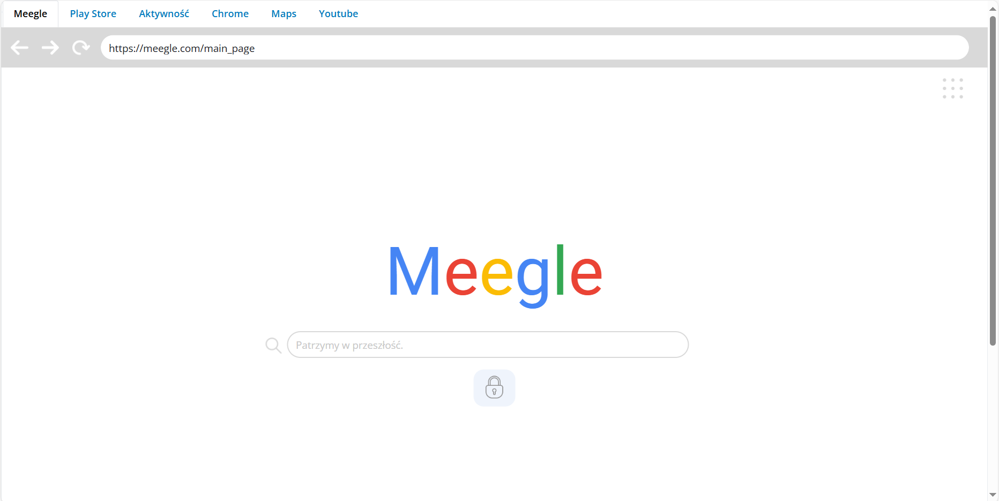
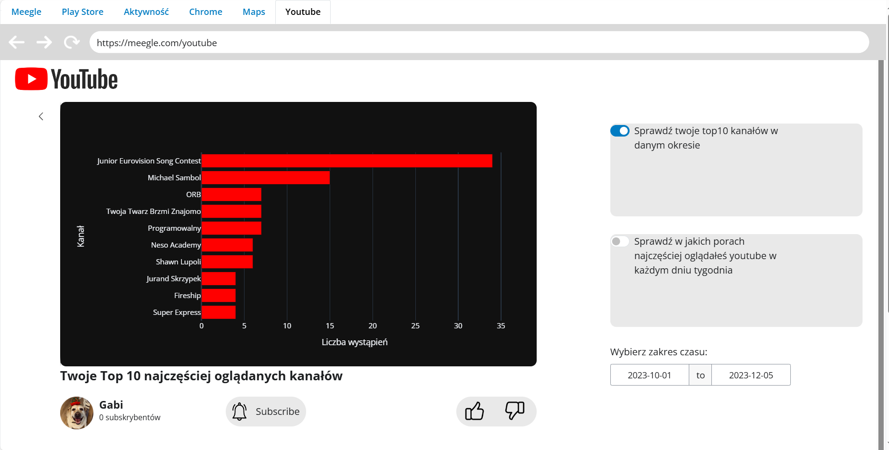
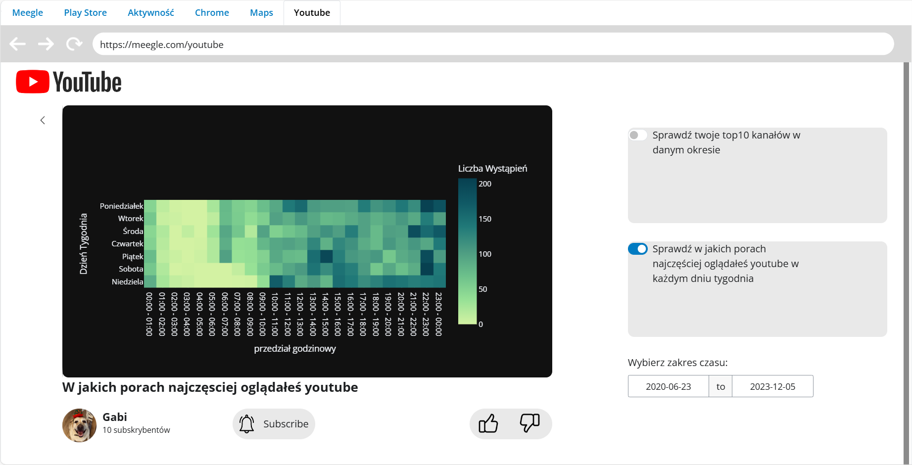
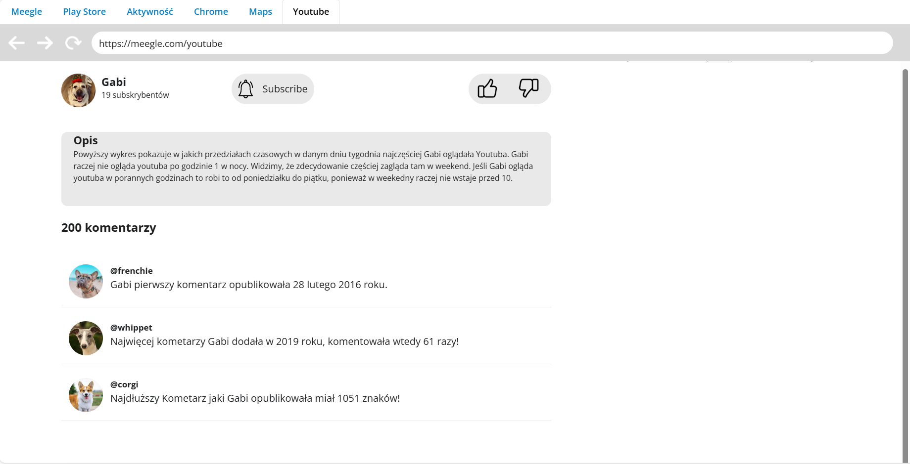

# MeegleAPP
Welcome to the GitHub repository for my part of the data visualization project. This project is part of the Data Visualization Techniques course in the 4th semester at Warsaw University of Technology. The goal of the project is to create an application that presents data about ourselves in an interesting way. We obtained the data from Google Takeout and decided to create an application similar to Chrome.

## Project overview
The objective of this project is to develop an application that creatively visualizes personal data. We used Python with the Shiny library, HTML, and CSS to build the application. I work on this project with my colleagues Igor Rudolf and Aleksandra Samsel. As the application is still in development, I am sharing only my part of the project.

## My contribution: Youtube Tab
I was responsible for developing the YouTube section of the application. Below are screenshots showcasing this part of the application.

### Main page

### Youtube tab with first plot

### Youtube tab with second plot

### Comments Section

